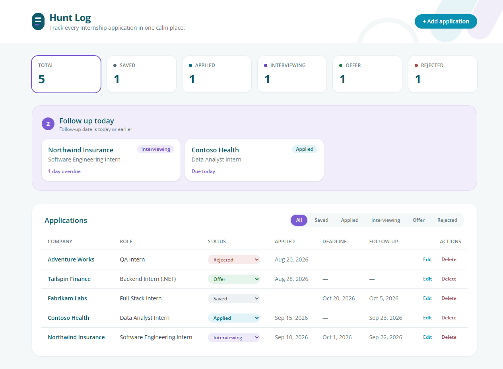
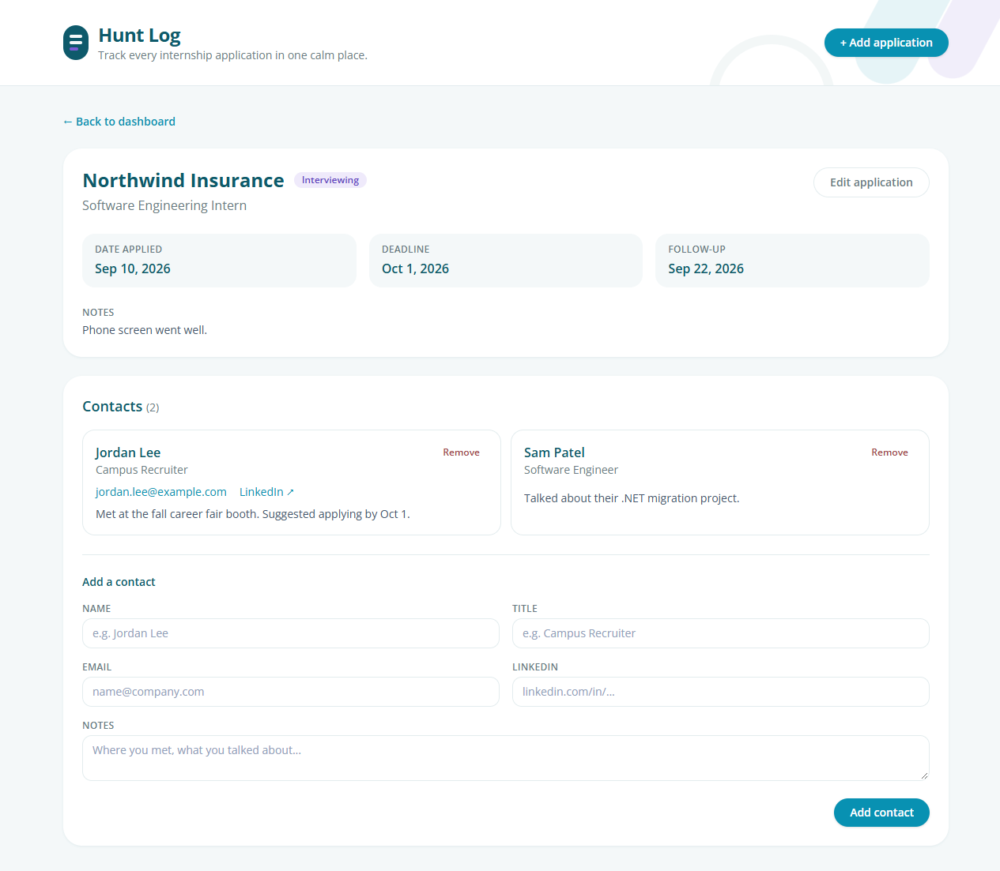
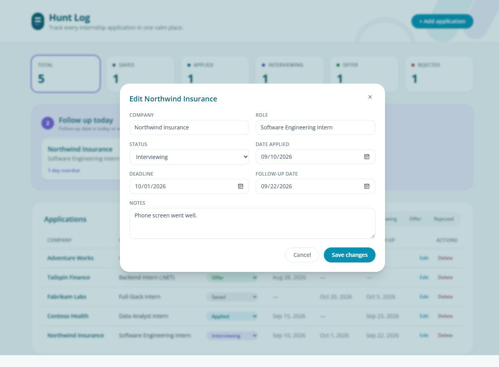

# Hunt Log

**A full-stack internship application tracker built with React + TypeScript, ASP.NET Core Web API, and Entity Framework Core.**

Hunt Log keeps my internship search organized in one place: every company and role I'm pursuing, where each application stands, upcoming deadlines, the people I've met at career fairs, and a daily list of who I need to follow up with.



---

## Why I built it

I was tracking my internship search across a spreadsheet, sticky notes, and my inbox, and follow-ups kept slipping through the cracks. I built Hunt Log to fix that for myself.

I also built it on purpose to **learn a professional, enterprise-style stack end to end**: a C# ASP.NET Core Web API with controllers, Entity Framework Core with migrations, a relational database, and a typed React front end. I can explain every layer of this project, from the HTTP request in the browser down to the SQL table.

## Features

- **Track applications:** company, role, status, date applied, deadline, follow-up date, and notes
- **Dashboard:** stat cards with counts by status (click one to filter the table)
- **Follow up today:** a panel listing every application whose follow-up date is today or overdue, most overdue first
- **Full CRUD:** add, edit (including a one-click inline status change), and delete with a confirmation step
- **Contacts:** record the recruiters and engineers I meet, linked to a specific application
- **Validation on both sides:** HTML form rules in the browser, plus data annotations enforced by the API

| Application detail with contacts | Editing an application |
| --- | --- |
|  |  |

> _Screenshot placeholders: the images in `docs/screenshots/` use sample data. Replace them with your own captures as the app evolves._

## Tech stack

| Layer | Technology |
| --- | --- |
| Front end | React 19, TypeScript, Vite |
| Styling | Tailwind CSS v4 (all colors defined once as theme tokens) |
| Back end | C# / ASP.NET Core 9 Web API using **controllers** |
| Data access | Entity Framework Core 9 (code-first, migrations) |
| Database | SQLite (local file), designed to swap to SQL Server |
| API docs / testing | Swagger UI (Swashbuckle) and a VS Code `.http` file |

## Architecture

```
┌──────────────────────────── Browser: http://localhost:5180 ────────────────────────────┐
│  React + TypeScript (Vite)                                                             │
│                                                                                        │
│   App.tsx (state) ──► Header · StatCards · FollowUpPanel · ApplicationTable            │
│        │              ApplicationDetail · ContactForm · Modal · ConfirmDialog          │
│        ▼                                                                               │
│   api.ts  (every fetch() call lives here, typed with types.ts)                         │
└────────┬───────────────────────────────────────────────────────────────────────────────┘
         │  JSON over HTTP (REST)      GET / POST / PUT / DELETE
         │  CORS: API only allows the origin http://localhost:5180
         ▼
┌──────────────────────────── ASP.NET Core Web API: http://localhost:5041 ───────────────┐
│  Program.cs: dependency injection setup · CORS · Swagger · auto-migrate on startup      │
│                                                                                        │
│   ApplicationsController   /api/applications[/{id}]                                    │
│   ContactsController       /api/applications/{id}/contacts,  /api/contacts/{id}        │
│        │   (DTOs + [ApiController] validation → 400 on bad input)                      │
│        ▼                                                                               │
│   HuntLogDbContext (EF Core)  ── LINQ is translated to SQL ──┐                          │
└──────────────────────────────────────────────────────────────┼─────────────────────────┘
                                                               ▼
                                       SQLite: api/huntlog.db  (or SQL Server)
                                       Applications 1 ──< Contacts
```

### Data model

```
Applications                              Contacts
─────────────────────────                 ─────────────────────────────
Id            PK                    ┌───< Id              PK
Company       text (100)            │     Name            text (100)
Role          text (100)            │     Title           text, optional
Status        text: Saved | Applied │     Email           text, optional
              | Interviewing        │     LinkedIn        text, optional
              | Offer | Rejected    │     Notes           text, optional
DateApplied   date, optional        └──── ApplicationId   FK → Applications.Id
Deadline      date, optional                              (cascade delete, indexed)
FollowUpDate  date, optional
Notes         text, optional
CreatedAt     UTC timestamp
```

### REST API

| Method | Route | Description | Success |
| --- | --- | --- | --- |
| GET | `/api/applications` | List all applications (newest first) | 200 |
| GET | `/api/applications/{id}` | Get one application | 200 / 404 |
| POST | `/api/applications` | Create an application | 201 + `Location` |
| PUT | `/api/applications/{id}` | Replace an application | 200 / 404 |
| DELETE | `/api/applications/{id}` | Delete an application and its contacts | 204 / 404 |
| GET | `/api/applications/{id}/contacts` | List contacts for an application | 200 / 404 |
| POST | `/api/applications/{id}/contacts` | Add a contact to an application | 201 / 404 |
| GET | `/api/contacts/{id}` | Get one contact | 200 / 404 |
| DELETE | `/api/contacts/{id}` | Delete a contact | 204 / 404 |

Invalid input (for example a missing company or a malformed email) returns **400** with ASP.NET's standard `ProblemDetails` JSON, and the UI displays that message.

### Project structure

```
hunt-log/
├── api/                          ASP.NET Core Web API
│   ├── Controllers/              ApplicationsController, ContactsController
│   ├── Data/HuntLogDbContext.cs  EF Core context + table mapping
│   ├── Dtos/                     Input shapes the client may send (prevents over-posting)
│   ├── Migrations/               Generated schema history (InitialCreate, AddContacts)
│   ├── Models/                   Application, ApplicationStatus, Contact
│   ├── Program.cs                Startup: DI, CORS, Swagger, migrations
│   ├── appsettings.json          Connection string + allowed client origin
│   └── HuntLog.Api.http          Ready-made requests for every endpoint
├── client/                       React + TypeScript (Vite)
│   └── src/
│       ├── api.ts                Typed fetch wrapper for every endpoint
│       ├── types.ts              TypeScript types mirroring the C# models
│       ├── dashboard.ts          Pure functions: counts by status, follow-ups due
│       ├── dates.ts              Time-zone-safe date helpers
│       ├── styles.ts             Shared Tailwind class strings
│       ├── index.css             Tailwind theme: every color in one place
│       ├── App.tsx               Top-level state and view switching
│       └── components/           UI components
└── docs/screenshots/
```

## Running it locally

**Prerequisites:** [.NET 9 SDK](https://dotnet.microsoft.com/download) and [Node.js](https://nodejs.org/) 20.19+ or 22.12+.

**1. Start the API** (terminal 1, from the repo root):

```powershell
dotnet tool restore          # installs the pinned dotnet-ef CLI (only needed for migration commands)
dotnet run --project api
```

The API listens on **http://localhost:5041**. On first run it creates `api/huntlog.db` and applies all migrations automatically. You can explore it at **http://localhost:5041/swagger**.

**2. Start the front end** (terminal 2):

```powershell
cd client
npm install
npm run dev
```

Open **http://localhost:5180**.

**Testing the API without the UI:** open `api/HuntLog.Api.http` in VS Code with the [REST Client](https://marketplace.visualstudio.com/items?itemName=humao.rest-client) extension and click **Send Request** above any request, or use Swagger UI.

**Changing the schema:** edit a model, then run:

```powershell
dotnet ef migrations add <DescriptiveName> --project api
```

The new migration is applied the next time the API starts.

## Switching from SQLite to SQL Server

The database provider is chosen in one place, `Program.cs`. Models, the DbContext, and controllers don't know which database they're talking to.

1. `dotnet add api package Microsoft.EntityFrameworkCore.SqlServer`
2. In `Program.cs`, change `options.UseSqlite(...)` to `options.UseSqlServer(...)`
3. In `appsettings.json`, set `ConnectionStrings:HuntLog` to a SQL Server connection string, e.g. `Server=localhost;Database=HuntLog;Trusted_Connection=True;TrustServerCertificate=True`
4. Delete `api/Migrations/` and run `dotnet ef migrations add InitialCreate --project api`. Migrations contain provider-specific SQL, so they are regenerated for SQL Server.

## Design decisions

- **Controllers over minimal APIs:** this mirrors how larger ASP.NET codebases are usually organized, with one class per resource.
- **DTOs for input:** clients send `ApplicationInput` / `ContactInput`, never the entity itself, so they can't overwrite server-owned fields like `Id` or `CreatedAt`.
- **Enums stored as text:** the database shows `"Interviewing"` instead of `2`, and reordering the enum can't corrupt existing rows.
- **`DateOnly` for calendar dates:** deadlines and follow-ups are days, not moments, so there's no time-zone drift. The front end compares `YYYY-MM-DD` strings directly.
- **Derived state in React:** stat counts and the follow-up list are computed from the application list on every render, never stored separately, so they can't drift out of sync.
- **Strict CORS:** the API allows only the front end's origin, not `*`.

## Next steps

- **Authentication:** add ASP.NET Core Identity or Google OAuth so each user sees only their own applications (add a `UserId` foreign key and `[Authorize]` on the controllers).
- **Migrate to SQL Server:** follow the steps above, then deploy to a hosted SQL Server / Azure SQL instance.
- **Kanban board view:** drag application cards between status columns (Saved → Applied → Interviewing → Offer), using the existing `PUT` endpoint to save the new status.
- Automated tests: xUnit + an in-memory SQLite database for the controllers, Vitest for `dashboard.ts` and `dates.ts`.
- Edit contacts in place, and search/sort in the applications table.
